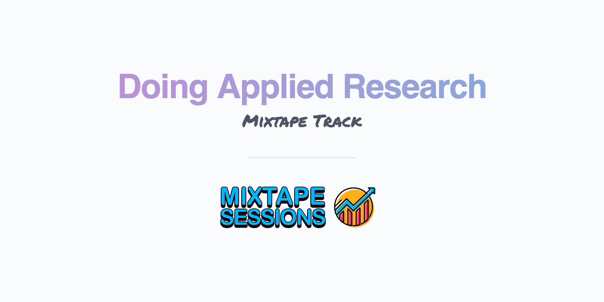

 
 

 

This course is intended to be a practical guide for early career economists doing applied research. The nuts and bolts of writing, publishing, and service to the profession are covered in two half-day sessions, each lasting roughly four hours (including short breaks). We begin by providing tips on selecting a research topic, doing a comprehensive literature search, and “pitching” your results. Next, we go through the publication process from choosing a journal to effectively responding to the comments of editors and reviewers. We wrap up by discussing networking, refereeing for economics journals, and getting the most out of conferences and departmental seminars. Each half-day session ends with an optional 30-minute Q&A about the academic job market.

     

<b> Starting Your Research Project (1 hour)</b>
 
<ol type="1">
<li>
What makes a research question viable? (Mark, 10-minute lecture)
  <ul>
  <li>
  The three hurdles:
    <ol type="1">
      <li>Is it interesting/important/policy relevant? How do you figure this out?</li>
      <li>Are you filling a clearly defined gap in the literature? How do you know? <i>Mark’s brilliant literature-review binders will help!</i></li>
      <li>Are the data available?</li>
    </ol>
  </li>
  <li>Q&A (10 minutes)</li>
  </ul>
</li>
<li>
  When to cut the cord (Mark, 10-minute lecture)
  <ul>
    <li>When to give up on a project
      <ul>
        <li>And when to pivot</li>
      </ul>
    </li>
    <li>How long to spend on a project before calling it quits</li>
    <li>Zero is a number too (but not a noisy zero!)
      <ul>
        <li>Examples of papers based on tight vs. noisy zeros</li>
        <li>Paper that was rejected because of noisy zeros</li>
        <li>Referee comment about tight zeros</li>
      </ul>
    </li>
    <li>File-drawer bias
    </li>
    <li>Q&A (10 minutes)</li>
  </ul>
</li>
<li>
Managing your research project (Mark, 10-minute lecture)
  <ul>
    <li>Allocating effort across multiple projects
      <ul>
        <li>Which paper to choose for your job market paper (JMP)</li>
      </ul>
    </li>
    <li>When to target a non-economics journal (e.g., a medical journal)</li>
    <li>Targeting journals early in the research process
      <ul>
        <li>Mark’s brilliant literature-review binders will help!</li>
      </ul>
    </li>
    <li>Q&A (10 minutes)</li>
  </ul>
</li>
</ol>

 

<b>Practical Tips for Writing Your Applied Paper (2 hours and 30 minutes)</b>
 
<ol type="1">
<li>
  Structure, length, tone, and grammar (Dan, 10-minute lecture)
  <ul>
    <li>Rules of thumb when writing your paper</li>
      <ul>
        <li>Examples of papers that get it right</li>
        <li>Examples of papers that didn’t </li>
      </ul>
  </ul>
</li>
<li>
  Writing the first half of your paper (Mark, 20-minute lecture) 
  <ul>
    <li>The introduction </li>
      <ul>
        <li>How many contributions are you making? How many is too many? </li>
        <li>Describe the identification strategy in the introduction. You are not writing a mystery novel! </li>
      </ul>
    <li>Background section </li>
      <ul>
        <li>What goes in background section? </li>
        <li>Include institutional details that are relevant to identification </li>
        <li>Should background section include a literature review? </li>
        <li>Is the literature review separate from the background section? </li>
        <li>How many footnotes are too many? </li>
      </ul>
    <li>Data and empirical methods </li>
      <ul>
        <li>Two separate sections or just one? </li>
        <li>Describing your data </li>
        <li>Some authors describe their empirical methods before the data section. Is this a good idea? </li>
      </ul>
    <li>Q&A (10 to 20 minutes) </li>
  </ul>
</li>
<li>
  Tips for tables (Dan, 10-minute lecture) 
  <ul>
    <li>What makes a good table?
      <ul>
        <li>Examples of “good tables” in Word and Latex </li>
        <li>Examples of tables that need some work… </li>
      </ul>
     </li>
  </ul>
</li>
<li>
  Useful phrases and common pitfalls when writing up results (Dan, 5-minute lecture) 
</li>
<li>
  How to think about statistical significance and magnitude (Dan, 10-minute lecture) 
</li>
<li>
  Data mining (Dan, 10-minute lecture) 
  <ul>
    <li>How (and why) to avoid data mining </li>
      <ul>
        <li>Recently published work on p-hacking </li>
      </ul>
    <li>Q&A (10 minutes)</li>
  </ul>
</li>
<li>
  Sensitivity and heterogeneity analyses (Mark, 15-minute lecture) 
  <ul>
    <li>How many robustness checks is too many? </li>
    <li>What goes in main text vs. appendix? </li>
      <ul>
        <li>Applied micro papers are becoming more and more bloated… </li>
      </ul>
    <li>Q&A (10 minutes) </li>
  </ul>
</li>
<li>
  How to write an effective conclusion (Mark, 10-minute lecture) 
  <ul>
    <li>Do you repeat yourself? How much? </li>
    <li>Should you provide policy recommendations? </li>
    <li>Should you opine about future research? </li>
    <li>Q&A (10 to 20 minutes)</li>
  </ul>
</li>
</ol>

 

<b> Optional for graduate students and job market candidates</b>
 
<ol type="1">
  <li>
    Q&A (30 minutes) on the following topics:
    <ul>
      <li>How do you pitch your JMP in 5-10 minutes?</li>
      <li>Which of your papers is your JMP?</li>
      <li>What are hiring committees are looking for?</li>
    </ul>
  </li>
</ol>

 

<b> The Publication Process (1 hour and 30 minutes)</b>
 
<ol type="1">
<li>
  Submitting to journals (Mark, 20-minute lecture)

  <ul>
    <li>Choosing which journals to target 
      <ul>
        <li>Mark’s brilliant literature-review binders will help! </li>
      </ul>
    </li>
    <li>Which journal do you submit to first? </li>
    <li>Journal rankings
      <ul>
        <li>Tradeoff between submitting too high and submitting too low</li>
        <li>Which ranking is correct? </li>
      </ul>
    </li>
    <li>Time-to-decision
      <ul>
        <li>Examples of turnaround times </li>
      </ul>
    </li>
    <li>Impact Factors (IFs) and why you should care
      <ul>
        <li>Examples of IFs </li>
        <li>Why does Health Economics have such a high IF? </li>
      </ul>
    </li>
    <li>Q&A (10-20 minutes) </li>
  </ul>
</li>
<li> 
  You received referee reports. Now what? (Dan, 30-minute lecture) 
  <ul>
  <li>
    Rejection 
    <ul>
      <li>Do you email the editor? </li>
      <li>Can you appeal the decision? </li>
      <li>What revisions should you make? </li>
    </ul>
  </li>
  <li>
    Revision request (R&R)
    <ul>
      <li>Do you email the editor? </li>
      <li>Point-by-point responses </li>
      <li>How to respond to positive/negative referee comments </li>
      <li>The referee is dead wrong. What do you do? </li>
      <li>What goes into the paper? </li>
      <li>The letter to the editor </li>
      <li>How long do you wait before resubmitting? </li>
    </ul>
  </li>
  <li>Q&A (10-20 minutes)</li>
  </ul>
</li>
</ol>

 

<b> Refereeing (30 minutes)</b>
 
<ol type="1">
  <li>
  The nuts and bolts of being a good referee (Dan, 20-minute lecture)
  <ul>
    <li>When to reject a referee request</li>
    <li>How to structure your referee report</li>
    <li>Common pitfalls</li>
      <ul>
        <li>Do not try to impress the editor</li>
        <li>Three pages is too long</li>
      </ul>
    <li>How to write a constructive report</li>
      <ul>
        <li>Negative but constructive</li>
        <li>Positive and constructive</li>
      </ul>
    <li>Q&A (10 minutes)</li>
  </ul>
  </li>
</ol>

 

<b> Conferences and Networking (40 minutes)</b>
 
<ol type="1">
<li>
Conferences (Mark, 15-minute lecture)
  <ul>
    <li>
      Which conferences should you attend?
    </li>
    <li>
      Organized sessions vs. single-paper submissions
      <ul>
        <li>Should you organize a session?</li>
        <li>How to organize a successful session</li>
      </ul>
    </li>
  </ul>
</li>
<li>
Networking (Mark, 15-minute lecture)
  <ul>
    <li>
    Identifying potential coauthors
      <ul>
        <li>How do you approach a potential coauthor?</li>
        <li>Do you need to try to write with everyone in my field?</li>
      </ul>
    </li>
    <li>
    Asking for the data others have collected
      <ul>
        <li>When should you ask for data?</li>
      </ul>
    </li>
    <li>
    Your seminar series
      <ul>
        <li>Don’t have funding for a seminar series? Find some!</li>
      </ul>
        <li>Q&A (10 minutes)</li>
    </li>
  </ul>
</li>
</ol>

 

<b> Ask the editor! (Q&A, 40 minutes)</b>
 

Mark is a coeditor at <i>Economic Inquiry</i>. Dan was the Editor-in-Chief of the <i>Economics of Education Review</i> for 6 years (from 2014-2019) and is a coeditor at the <i>American Journal of Health Economics</i> and the <i>Journal of Policy Analysis and Management</i>. We would like to wrap up the workshop by talking about our experiences as editors.

 

<b> Optional for graduate students and job market candidates</b>
 
<ol type="1">
  <li>
  Q&A (30 minutes) on the following topics:

  <ol type="i">
    <li>How do you pitch your JMP in 5-10 minutes?</li>
    <li>Which of your papers is your JMP?</li>
    <li>What are hiring committees are looking for</li>
  </ol>
  </li>
</ol>
